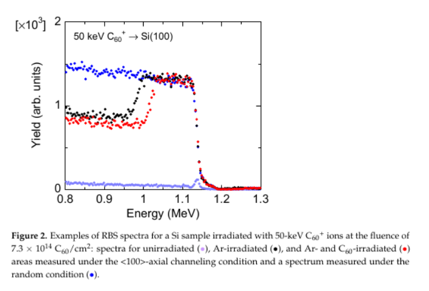
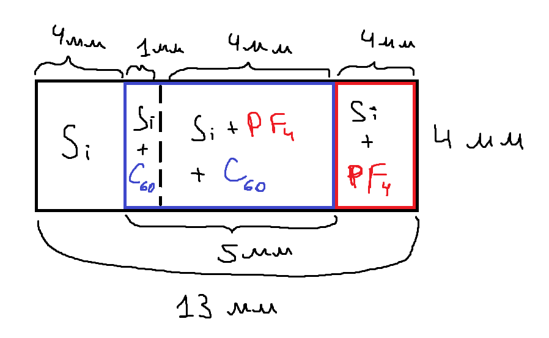

## Имеющиеся данные.

Основная идея повторяет ранее проведенный эксперимент японских коллег [Наруми и др](https://docs.yandex.ru/docs/view?url=ya-disk-public%3A%2F%2FPOGuvISqY%2FClVHHyEXPaQbK%2Bqx9gJUkk9Re1R0dWbpBO3jS%2Bmy4Cn6c4x1BCpUBKq%2FJ6bpmRyOJonT3VoXnDag%3D%3D%3A%2FQuantumBeamSci6(2022)12_Si%20sputtering%20by%20C60%20Experiment.pdf&name=QuantumBeamSci6(2022)12_Si%20sputtering%20by%20C60%20Experiment.pdf&nosw=1).
В оригинале исходный образец - полоска кремния (100) n-типа со сторонами 5 и 13 мм, которая предварительно была 
очищена методом RCA. После этого треть была закрыта, а оставшаяся часть облучалась ионами Ar с энергией **200 кэВ**
и флюенсом **5\*10^15 ионов/см^(2)**. В результате на 2/3 образца образовался аморфный слой глубиной **~360 нм**. После
этого треть аморфизованной области облучалась ионами С_60 по нормали к поверхности с энергиями **10-120 кэВ** и **100-540 кэВ**
и флюенсом **7.3\*10^14 С_60/см^(2)**. 
В итоге образец был разделен на 3 равных области:

1. Необлученная область;
2. Область облученная только аргоном;
3. Область, аморфизованная аргоном и облученная ионами С_60;

Полученные зоны на образце исследовались методом RBS для определения толщины аморфного слоя на поверхности. Результат
показан на картинке ниже. Исходя и разности толщины аморфного определялся **коэффициент распыления** кремния ионами С_60.

Кроме того, есть ранее проведенные эксперименты по облучению Si ионами С_60 с энергиями **5 и 8 кэВ** при температурах
**373, 473, 573 и 673 К** до одинаковой дозы **3.8*10^16 см^-2** [Пуха и др](https://docs.yandex.ru/docs/view?url=ya-disk-public%3A%2F%2FPOGuvISqY%2FClVHHyEXPaQbK%2Bqx9gJUkk9Re1R0dWbpBO3jS%2Bmy4Cn6c4x1BCpUBKq%2FJ6bpmRyOJonT3VoXnDag%3D%3D%3A%2FCarbonFilms%2F433323_1_En_15_Chapter_fin.pdf&name=433323_1_En_15_Chapter_fin.pdf&nosw=1). Облучение при **5 кэВ** дает углеродную пленку, при **8 кэВ** и **Т = 373 и 473 К** распыление.
При **Т = 573 и 673 К** - рост пленки. При **Т = 673 К** наблюдается образование графитовых нанокристаллов (чешуек) перпендикулярно поверхности.
Также, в случае распыления XPS анализ показывает формирование связей типа Si-C, однако подробный анализ не проводился. 

Экспериментально было получено [ссылки](), что порог распыления наблюдается на энергии ионов С_60 **10 кэВ**. По результатам данного 
эксперимента планируется исследовать влияние температуры на распыление и формирование углеродной пленки при энергиях вблизи порога распыления.

___

Есть наш эксперимент по облучению кремния ионами С_60 с энергиями **7.5 и 8 кэВ** и дозой **7.5*10^14 С_60/см^(2)**
при температурах **300, 425 и 525 К**. Часть образца была закрыта маской из осколка кремния. На границе пытались искать ступеньку и 
не нашли. Но нашли глубокую канавку. Сейчас эти образцы на XPS анализе для определения наличия и концентрации Si-C и С-С связей, а также 
относительной концентрации sp2-sp3 гибридизованных С-С связей.

___

## Планируемая работа.

Планируется провести аналогичный эксперимент, но с другими условиями. Аморфизовать поверхность ионами PF4, а не Ar. Также,
разделение по областям предполагается немного изменить. Таблица с новыми параметрами и схемой разделения кремния на области 
прикреплены ниже:

**Таблица параметров:**

|Энергия С_60, кэВ | Температура подложки, К | Флюенс С_60, см^(-2) |           Флюенс PF4, см^(-2)             |Энергия PF4, кэВ|
| ---------------- | ----------------------- | -------------------- | ----------------------------------------- |----------------|
|     8, 12, 15    |          300/700        |    3*10^15, 10^16    | 10^14 => толщина аморфного слоя: 30-40 нм |      65        |

**Схема областей по мере эксперимента:**

1. Чистый кремний:
  
2. Облучение ионами PF4 и аморфизация слоя:
   
3. Облучение ионами С_60 и распыление поверхности:
   
4. Итоговый образец:
   
